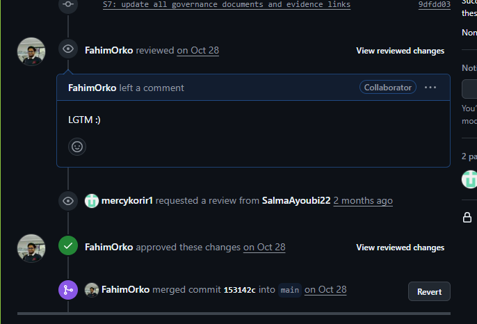
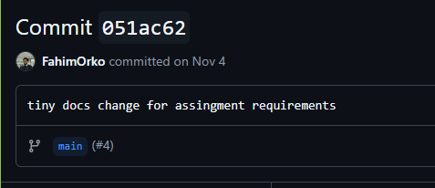
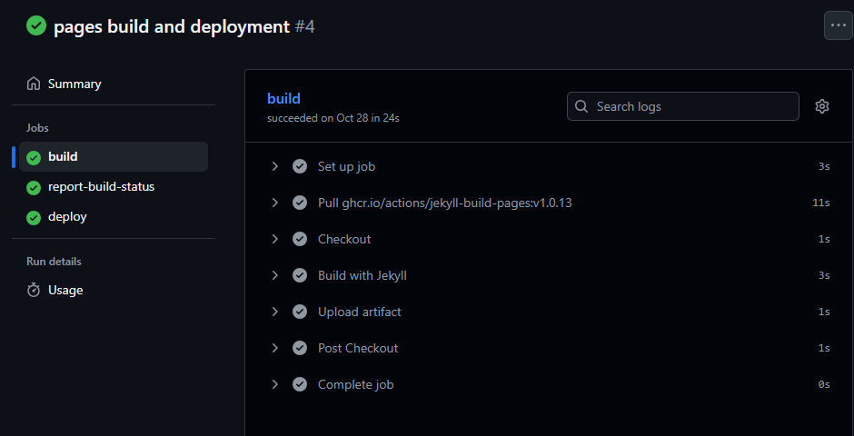

# S7 Evidence Index

- PR-A (Governance PR): [Link](https://github.com/mercykorir1/software-engineering/pull/1)
  
- PR-B (Tiny feature/docs PR):
  - [Link](https://github.com/mercykorir1/software-engineering/commit/051ac62d3dc9774a971e936ed3eb6cba84779bd9)
  - 
- Conflict resolution commit:
- Green CI run (PR-A):
  - [Link](https://github.com/mercykorir1/software-engineering/commit/153142c585df93f6adc64b7bbf24c0e27750f0ee)
    - 

## Governance Artifacts

- [CONTRIBUTING.md](docs/governance/CONTRIBUTING.md)
- [PR_CHECKLIST.md](docs/governance/PR_CHECKLIST.md)
- [WORKING_AGREEMENT.md](docs/governance/WORKING_AGREEMENT.md)
- [Pull_Request_Template](.github/pull_request_template.md)
- [CODEOWNERS](.github/CODEOWNERS)
- [CI workflow](.github/workflows/ci.yml)
- [BRANCH_PROTECTION.md](docs/governance/BRANCH_PROTECTION.md)
- [LABELS.md](docs/governance/LABELS.md)

Instructors added (read access): yes — course instructors added as collaborators
