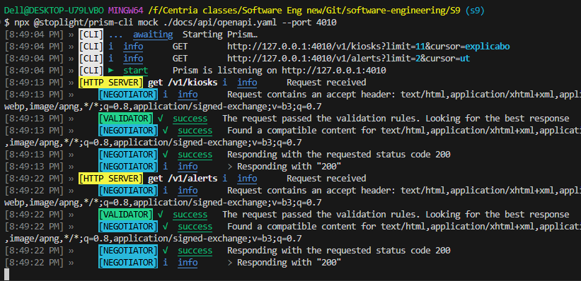
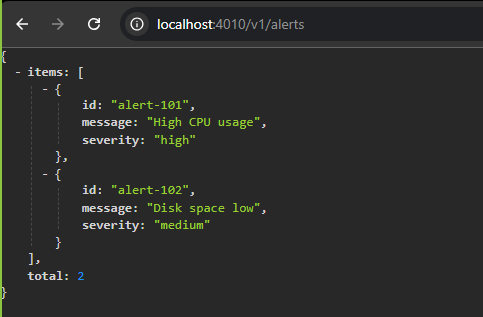
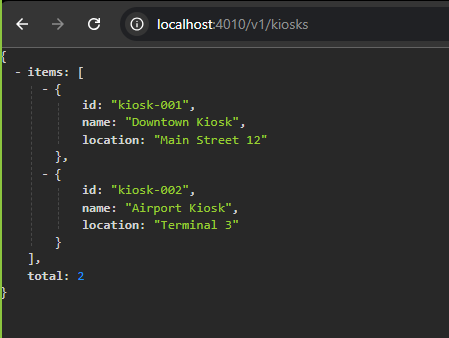
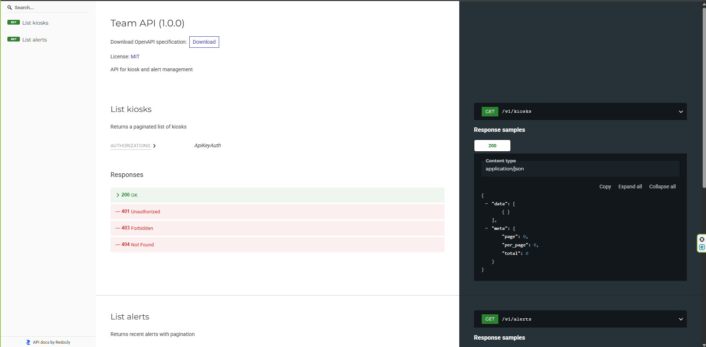

# S9 — Modeling & Documentation + API Design

## Index of Evidence

- API Table: [docs/api/API_Table.md](docs/api/API_Table.md)
- JSON Examples: [docs/api/examples/](docs/api/examples/)
  - `kiosks_list.json`, `alerts_list.json`, `alert_create.json`, `error_422.json`, `error_409.json`
- OpenAPI Spec (minimal): [docs/api/openapi.yaml](docs/api/openapi.yaml)
- Postman collection (smoke tests): [tests/postman_collection.json](tests/postman_collection.json)
- PRISM Mock Notes: [mock/PRISM_NOTES.md](mock/PRISM_NOTES.md)
- AI Assistance Note: [AI_Use_Note.md](AI_Use_Note.md)

## Verification Evidence

- Mock server run + Postman smoke tests
  - Prism mock running on port 4010
  - Endpoints `/v1/kiosks` and `/v1/alerts` returning example data
- Cursor pagination verified in Alerts GET
- Idempotent POST verified in Alerts POST with `Idempotency-Key`
- OpenAPI lint successful (Redocly) with only one non-blocking warning (`localhost` server URL)
- Optional: HTML and bundled JSON generated for API documentation

Instructors have read access: Yes

## ScreenShots

- Mock server running evidence
  

- Endpoints working evidence (Postman smoke tests)
  
  

- OpenAPI HTML doc
  
